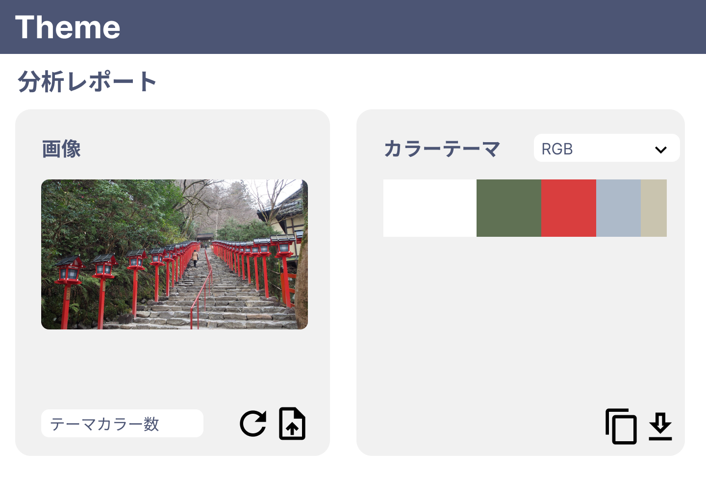
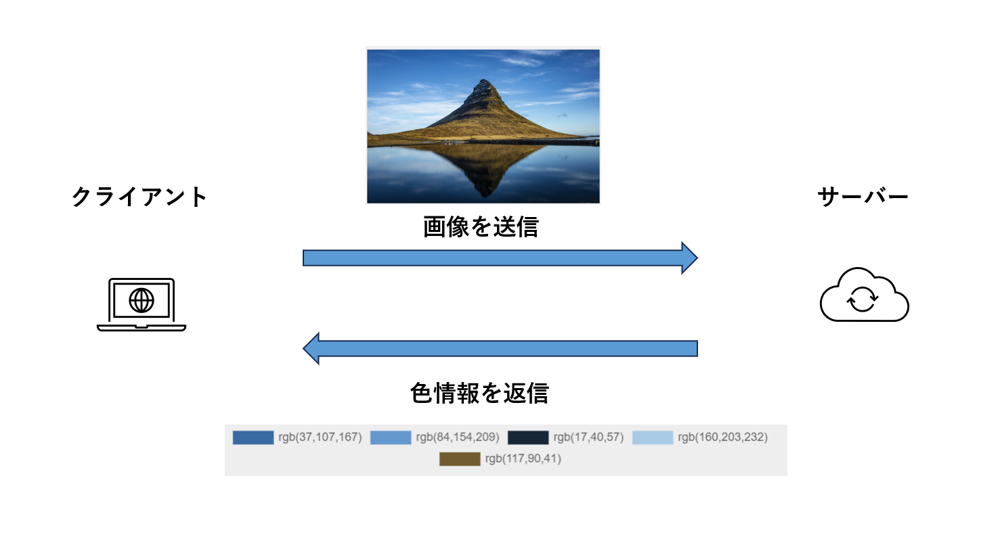
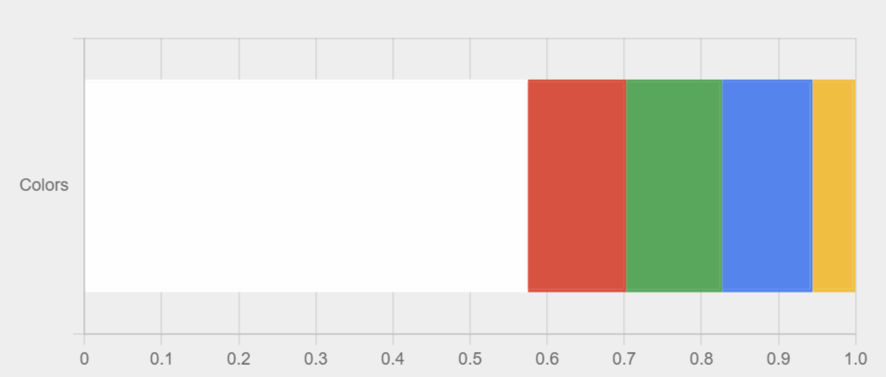
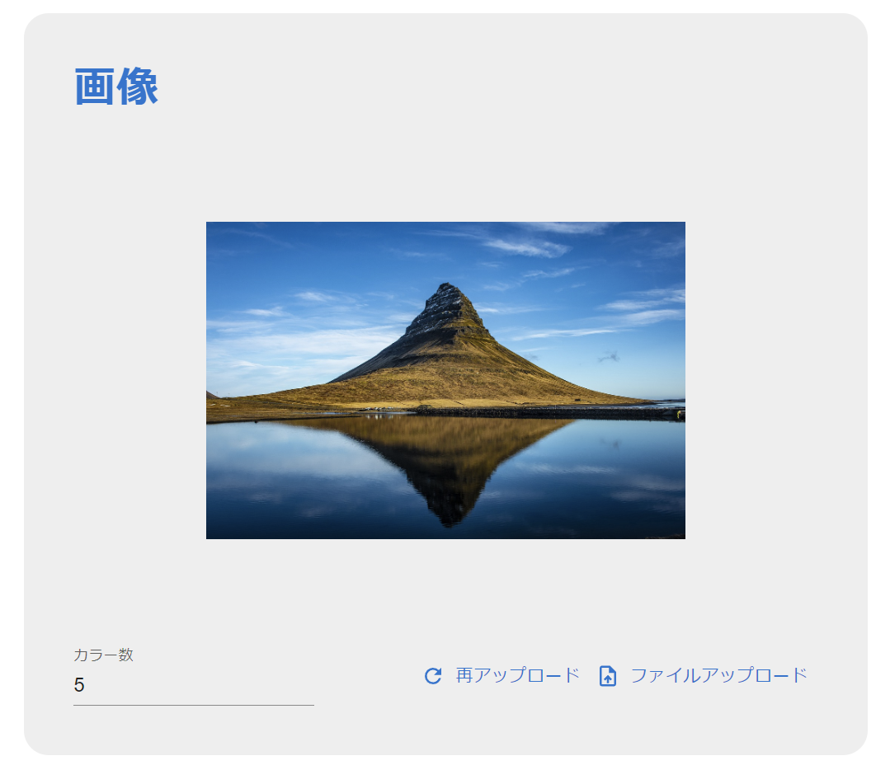
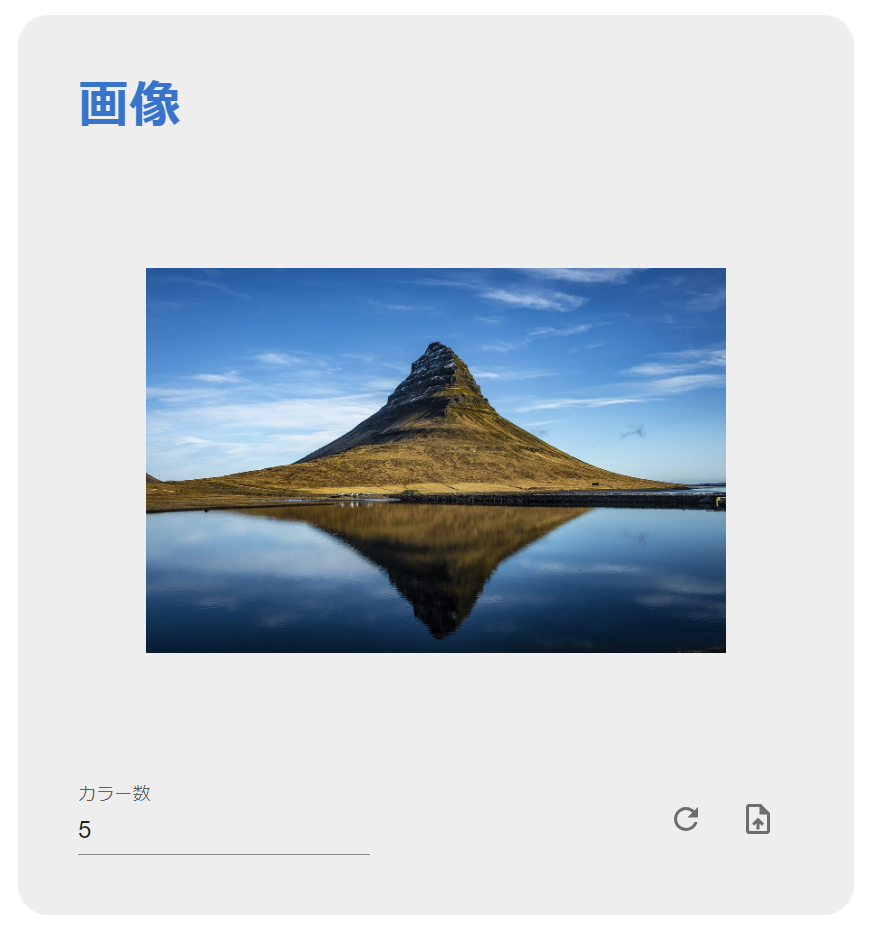
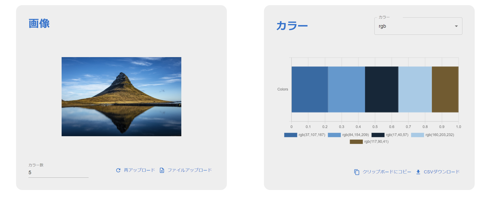

# 簡易仕様書

### アプリ名

K colors picker

### 対象OSおよびブラウザ(ver.含む)

OS: Windows

ブラウザ: Chrome(115.0.5790.110), Microsoft edge(115.0.1901.188)

### 開発環境/⾔語

開発環境: windows

言語: typescript, python

### 機能概要(機能⼀覧)
読み取った画像から含まれる色をグループに分け、グループ内の主要な色を表示する。

取得された色はcsvでダウンロードしたり、クリップボードにコピーできる

### 主なフレームワーク・ライブラリ(ver.含む)

クライアント: 
|ライブラリ名|ver|
|-|-|
|react|18.2|
|react-chartjs-2|5.2|
|react-redux|8.1.2|
|mui|5.14|

サーバー:
|ライブラリ名|
|-|
|fast-api|
|scikit-learn|

### テーブル定義(ER図)などの設計ドキュメント
#### 初期デザイン案

#### アプリの概念図

### コンセプト
* 画像からカラーテーマを得る
* いい色の研究に役立てる

### こだわったポイント
* 単に画像の色を取得するのではなく、kmeansを用いてグループにまとめてその中心を取得することで、画像に使われている色の特徴をつかみやすくする
* 簡単にUIやにAPIを構築できるライブラリを用いて、開発コストを抑える
* サーバー側では画像を保存しないようにし、匿名性を保証している
* すぐに使いやすいように、アイコンボタンなどで情報を補完したり、複雑な操作をしないようにした。

### デザイン⾯でこだわったポイント
#### 白を見やすくするために背景を少しグレーに

#### ボタンの表示を横幅が狭くなるとアイコンボタンにする
|横幅広|横幅狭|
|-|-|
|||
#### 機能ごとに領域を分けて整理

### ⾃⼰評価
#### 良いと思った点
* クライアントとサーバーに役割を分けて作ることができた
* サーバーはホスティングサービスにクライアントはGitHub PageにデプロイしたのでWebアプリケーションのように使うことができる
* MaterialUI、グラフはChartJSを使用することで短時間でそれなりの見た目を作ることができた
* 機械学習を活用したWebアプリケーションを作ることができた（サーバーではkmeansという物を分類するための機械学習アルゴリズムを用いて、色のグループ分けを行っている）

#### 悪いと思った点
* GitHub Pageにデプロイしたは良いが、Chromeでアクセスするとフィッシングサービスだと言われてアクセスできないエラーを解決できなかった。(Edgeだとアクセスできる。なぜ？)(追記:googleに問い合わせたら直りました)

